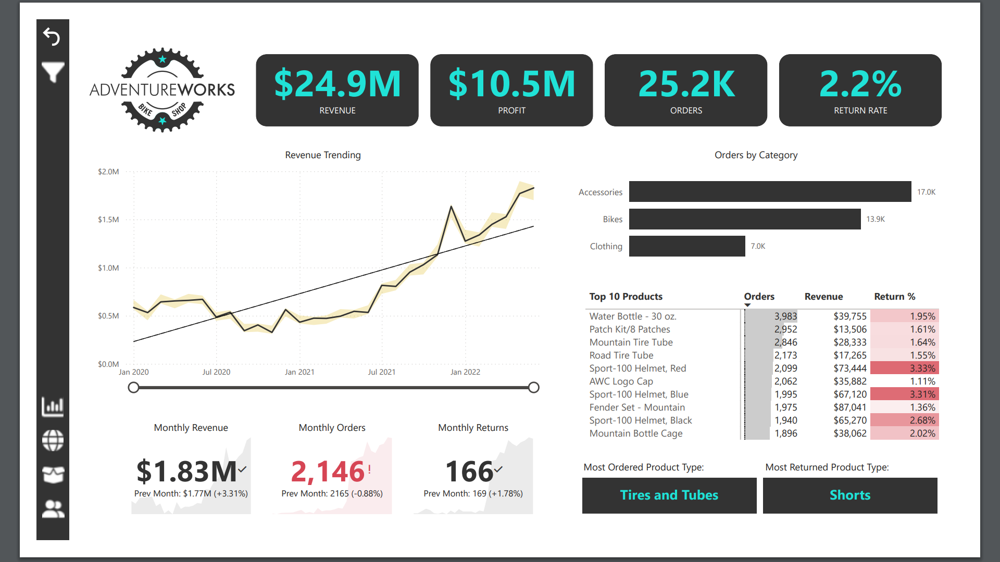
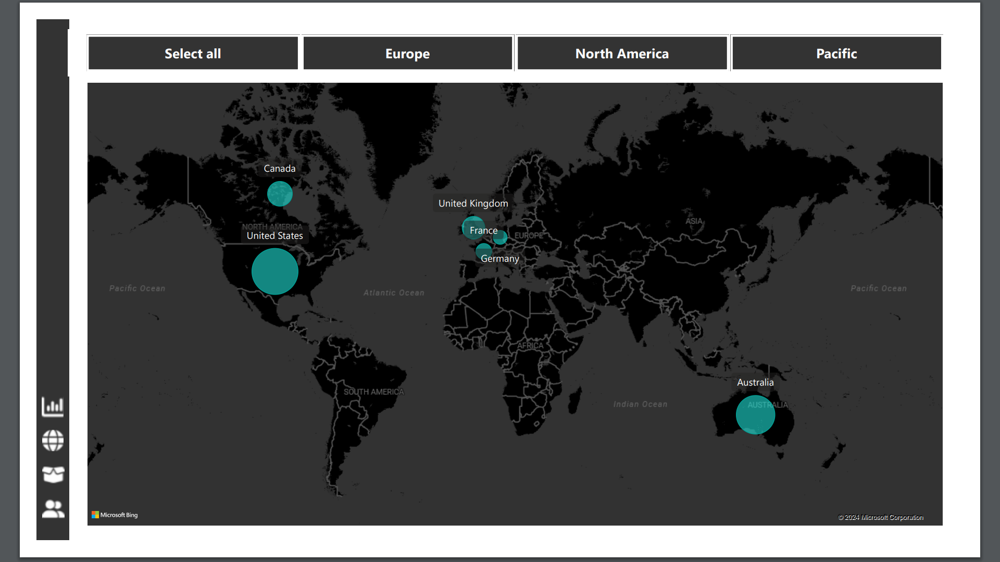
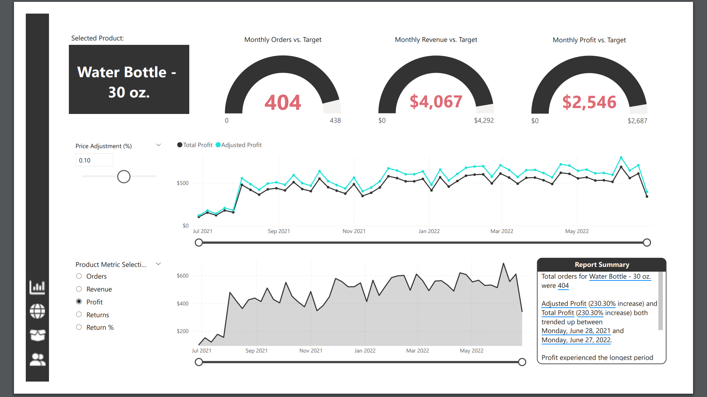
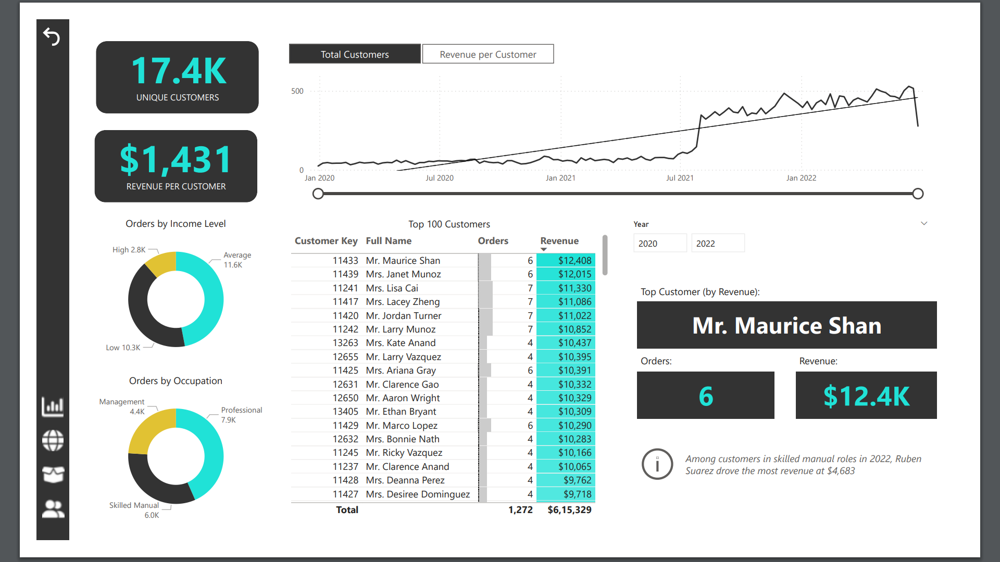

# Power_BI_Maven_Analytics
This is an exciting project I had prepared to push my limits in Power BI. 

## Project Overview
This project features an interactive Power BI dashboard analyzing sales data for AdventureWorks, a global retail company. The dashboard provides insights into revenue, profit, orders, returns, customer demographics, and product performance. It demonstrates my ability to create dynamic visualizations and extract actionable insights to support business decisions.

## Key Features of the Dashboard

Revenue and Profit Analysis:

Total revenue: $24.9M
Total profit: $10.5M
Monthly trends with year-over-year growth rates and profit margin visualization.
Order Performance:

Total orders: 25.2K
Monthly order tracking with a comparison to targets.
Breakdown of orders by category (Accessories, Bikes, Clothing).
Returns Analysis:

Return rate: 2.2%
Identification of the most returned product types, highlighting areas for quality improvements.
Top Products:

Top 10 products by orders, revenue, and return rate.
Analyse best-selling products like the "Water Bottle - 30 oz." and its profitability.
Customer Insights:

17.4K unique customers with an average revenue per customer of $1,431.
Orders are segmented by customer income level and occupation.
Highlight the top customers driving revenue.
Geographical Analysis:

Revenue and orders are distributed across major regions (e.g., North America, Europe, Pacific).
Heatmaps showing regional performance.
Influencer Analysis:

Factors influencing key metrics like homeownership and average retail price.
Key customer behaviour drivers include income levels, education, and marital status.
Skills and Tools Demonstrated
Data Analysis:

Explored data to uncover trends, patterns, and anomalies.
Focused on identifying actionable insights to improve business performance.
Data Visualization:

Designed interactive charts and KPIs for revenue, profit, and order trends.
Developed user-friendly visuals to compare actual performance against targets.
Business Intelligence:

Used advanced Power BI features like filters, slicers, and drill-through pages.
Enabled cross-regional comparisons and customer segmentation.

## Key Learnings
How to structure a business intelligence report for effective decision-making.
Techniques to highlight performance gaps and opportunities using data storytelling.
Strategies for integrating key influencers to enhance product pricing and customer engagement.

## Sample Dashboards

[]&nbsp;

[]&nbsp;

[]&nbsp;

[]&nbsp;
